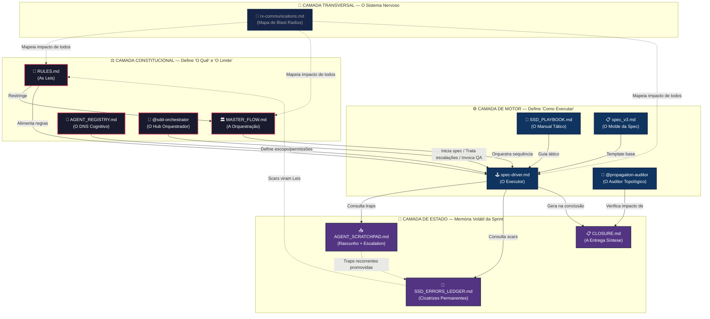
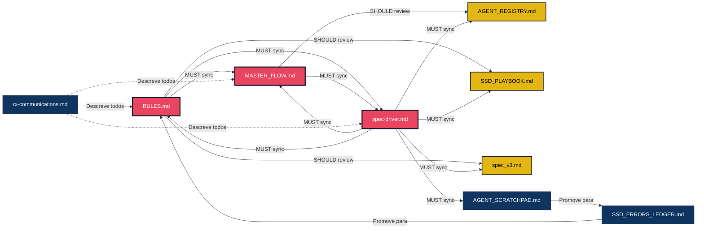

# 🏛️ Flow SDD — A Constituição dos 9 Arquivos

> Mapa visual e funcional dos arquivos e agentes que compõem o lastro do processo **Spec-Driven Development (SDD)** no framework H.O.K Forge.

---

## 🗺️ 1. Diagrama de Arquitetura (Visão Holística)

---

## 🧬 2. Perfil Individual dos 9 Arquivos

### ⚖️ Camada Constitucional (A Lei)

#### 1. `RULES.md` — As Leis do Ecossistema
| Atributo | Detalhe |
|----------|---------|
| **Localização** | `.context/brain/RULES.md` |
| **Papel no SDD** | Fonte de todas as restrições. Contém 13+ regras formais (CLOSE_WAVE, SAM_SYNTAX, MIMO, etc.) que o executor **deve** obedecer. |
| **Lê de** | `LEARNINGS.md`, `JOURNAL.md` (cicatrizes viram leis) |
| **É consumido por** | `spec-driver.md`, `validate_context.py`, `MASTER_FLOW.md` |
| **Blast Radius** | 🔴 **CRÍTICO** — Alterar uma regra aqui impacta **todos** os arquivos do ecossistema. |

#### 2. `MASTER_FLOW.md` — A Orquestração
| Atributo | Detalhe |
|----------|---------|
| **Localização** | `.context/brain/MASTER_FLOW.md` |
| **Papel no SDD** | Define a coreografia completa Hub & Spoke, o ciclo de vida TLC (5 atos), e o rito de Pre-Close Audit. É o "manual de operações" do framework. |
| **Lê de** | `RULES.md` (restrições), `TLC_INTEGRATION.md` |
| **É consumido por** | `spec-driver.md`, `qa-validator.md` |
| **Blast Radius** | 🔴 Alterar o fluxo aqui desalinha o comportamento do `spec-driver` e do QA. |

#### 3. `AGENT_REGISTRY.md` — O DNS Cognitivo
| Atributo | Detalhe |
|----------|---------|
| **Localização** | `.context/brain/AGENT_REGISTRY.md` |
| **Papel no SDD** | Cadastro de todos os agentes com especialidade, permissões, contexto auto-load e gatilhos. Define **quem** pode fazer **o quê**. Contém a blindagem Chain-Skills V3. |
| **Lê de** | `.agent/subagents/` (definições de agentes) |
| **É consumido por** | Roteamento do Orquestrador, `spec-driver.md` (para saber suas próprias restrições### ⚙️ Camada de Motor (O Como)

#### 4. `spec-driver.md` — O Executor Mecânico
| Atributo | Detalhe |
|----------|---------|
| **Localização** | `.agent/subagents/spec-driver.md` |
| **Papel no SDD** | Subagente determinístico que executa a cadeia de 9 skills. Opera sob Zero-Trust: proibido usar ferramentas genéricas de escrita. Contém protocolos ANTI-LOOP e RESUME. |
| **Lê de** | `RULES.md`, `MASTER_FLOW.md`, `AGENT_REGISTRY.md`, `SSD_PLAYBOOK.md`, `AGENT_SCRATCHPAD.md`, `SSD_ERRORS_LEDGER.md` |
| **Produz** | Mutações em `STATE.md`, código via `write_with_validation.py`, escalations no `SCRATCHPAD` |
| **Blast Radius** | 🔴 **Acoplamento Extremo** — O próprio arquivo declara: qualquer alteração DEVE ser sincronizada com `MASTER_FLOW`, `RULES`, `spec_v3`, `SCRATCHPAD`, `PLAYBOOK` e `AGENT_REGISTRY.md`. |

#### 5. `SSD_PLAYBOOK.md` — O Manual Tático
| Atributo | Detalhe |
|----------|---------|
| **Localização** | `.specs/features/SSD_PLAYBOOK.md` |
| **Papel no SDD** | Descreve as 4 fases (A-D) e as 9 skills em detalhe operacional. Documenta o Rito do Córtex (MiMo), protocolo Anti-Loop, e papel do Orquestrador no desbloqueio. |
| **Lê de** | `RULES.md` (restrições base), experiência acumulada |
| **É consumido por** | `spec-driver.md` (guia tático direto) |
| **Blast Radius** | 🟡 Mudança aqui altera o comportamento tático do executor sem alterar as leis formais. |

#### 6. `spec_v3.md` — O Molde da Spec
| Atributo | Detalhe |
|----------|---------|
| **Localização** | `.agent/templates/spec_v3.md` |
| **Papel no SDD** | Template YAML+Markdown que estrutura toda nova spec: frontmatter com `feature_id`, `type`, `contract_mode`, `sprint_allow`, `dod`, `qa_signoff`. Inclui seção de Raw Payloads (Injeção Atômica). |
| **Lê de** | Padrões definidos em `RULES.md` (regra 1.1, 1.4) |
| **É consumido por** | Hub/Planner ao criar nova feature, `spec-driver` ao interpretar o contrato |
| **Blast Radius** | 🟡 Alterar o template afeta **todas as specs futuras**. Specs existentes não são retroativamente afetadas. |

---

### 🧠 Camada de Estado (Memória)

#### 7. `AGENT_SCRATCHPAD.md` — O Rascunho Volátil
| Atributo | Detalhe |
|----------|---------|
| **Localização** | `.agent/templates/AGENT_SCRATCHPAD.md` (template) / `.specs/features/<feature_id>/AGENT_SCRATCHPAD.md` (instância física por feature) |
| **Papel no SDD** | Buffer de comunicação entre Executor e Orquestrador. Existe em duas formas: o template estático e a instância física copiada para cada feature ativa onde o executor escreve escalações (INBOX) e o Orquestrador injeta resoluções (DIRECTIVES). |
| **Lê de** | Erros em tempo de execução, `SSD_ERRORS_LEDGER.md` (traps promovidas) |
| **É consumido por** | `spec-driver.md` (primeira consulta em caso de erro) e Orquestrador (para injetar diretivas) |
| **Blast Radius** | 🟢 Baixo impacto sistêmico. É volátil por design (limpo entre features). Traps crônicas são **promovidas** ao Ledger. |

#### 8. `SSD_ERRORS_LEDGER.md` — As Cicatrizes Permanentes
| Atributo | Detalhe |
|----------|---------|
| **Localização** | `.specs/features/SSD_ERRORS_LEDGER.md` |
| **Papel no SDD** | Registro permanente de erros recorrentes (Scars). Cada entrada documenta: data, feature, erro, causa raiz, correção e regra adicionada. Alimenta o sistema de vacinação (`inject_learnings.py`). |
| **Lê de** | Post-mortems do `JOURNAL.md`, escalations do `SCRATCHPAD` |
| **É consumido por** | `inject_learnings.py` → `*.enriched.md`, `RULES.md` (scars viram leis) |
| **Blast Radius** | 🟡 Nova scar → nova vacina injetada em todas as specs futuras via MiMo. |

#### 9. `CLOSURE.md` — A Entrega Síntese
| Atributo | Detalhe |
|----------|---------|
| **Localização** | `.specs/features/<feature_id>/CLOSURE.md` |
| **Papel no SDD** | Relatório de fechamento analítico de preenchimento obrigatório na Skill 9 (Handoff). Documenta a rastreabilidade (plano original vs. entrega real), modificações executadas, cicatrizes agregadas (SCARs) e pendências de backlog. |
| **Lê de** | `STATE.md`, `tasks.md`, `git diff` |
| **É consumido por** | `@qa-validator` para auditoria final e signoff do contrato |
| **Blast Radius** | 🟢 Baixo. É um artefato descritivo gerado no encerramento do ciclo. |

---

### 📡 Camada Transversal

#### 10. `rx-communications.md` — O Sistema Nervoso
| Atributo | Detalhe |
|----------|---------|
| **Localização** | `.context/maintenance/rx-communications.md` |
| **Papel no SDD** | Mapa SSOT de toda a topologia de conectividade. Documenta quem afeta quem (blast radius) tanto para arquivos de governança quanto para scripts de automação. É o "raio-X" que previne modificações silenciosas. |
| **Lê de** | Estado real do repositório (reflete a realidade) |
| **É consumido por** | `@gov-friction-analyst`, qualquer agente que precise avaliar impacto antes de modificar |
| **Blast Radius** | 🟢 Não tem impacto executivo direto. É **descritivo**, não prescritivo. Mas se estiver desatualizado, agentes tomam decisões com mapa errado. |

---@gov-friction-analyst`, qualquer agente que precise avaliar impacto antes de modificar |
| **Blast Radius** | 🟢 Não tem impacto executivo direto. É **descritivo**, não prescritivo. Mas se estiver desatualizado, agentes tomam decisões com mapa errado. |

---

## 🔄 3. Matriz de Propagação de Mudanças

> **"Se eu altero o Arquivo A, o que preciso revisar?"**

### Tabela Resumo de Impacto

| Se alterar... | MUST sync (obrigatório) | SHOULD review (recomendado) |
|:---|:---|:---|
| `RULES.md` | `MASTER_FLOW`, `spec-driver` | `PLAYBOOK`, `spec_v3`, `REGISTRY` |
| `MASTER_FLOW.md` | `spec-driver` | `REGISTRY`, `PLAYBOOK` |
| `spec-driver.md` | `MASTER_FLOW`, `RULES`, `spec_v3`, `SCRATCHPAD`, `PLAYBOOK`, `AGENT_REGISTRY` | — |
| `AGENT_REGISTRY.md` | — | `spec-driver` (se mudar permissões) |
| `SSD_PLAYBOOK.md` | — | `spec-driver` (se mudar fases/skills) |
| `spec_v3.md` | — | `spec-driver`, `PLAYBOOK` |
| `AGENT_SCRATCHPAD.md` | — | `LEDGER` (se trap recorrente) |
| `SSD_ERRORS_LEDGER.md` | — | `RULES` (se scar crônica), `SCRATCHPAD` |
| `rx-communications.md` | — | Todos (se topologia mudar) |

---

## ⛓️ 4. Sequência de Execução (A Cadeia das 9 Skills)

```mermaid
sequenceDiagram
    participant Hub as 🧑 Orquestrador (Hub)
    participant SD as 🕹️ spec-driver
    participant Gate as 🔒 write_with_validation.py
    participant QA as 🔍 qa-validator
    participant Prop as 🤖 @propagation-auditor

    Note over Hub: Step 0: Pre-Flight Check (Baseline)
    Note over Hub: Step 1 & 2: Blast Radius & Draft Spec
    Note over Hub: Step 3: Vaccine Injection (MiMo) & Setup Commit
    Hub->>SD: Invocação: @spec-driver [instrução]

    rect rgb(26, 26, 46)
        Note over SD: FASE A — Preparação
        SD->>SD: Skill 1: context-loader<br/>(Lê RULES + enriched.md)
        SD->>SD: Skill 2: spec-digest<br/>(Valida STATE.md + allow_list)
        SD->>SD: Skill 3: strategy-planner<br/>(Planos e STRATEGY_LOG no STATE.md)
    end

    rect rgb(15, 52, 96)
        Note over SD: FASE B — Blindagem
        SD->>SD: Skill 4: baseline-anchor<br/>(Hash do STATE.md / git rev-parse)
        SD->>SD: Skill 5: scope-guard<br/>(Physical Check: dir/ls allow_list)
    end

    alt Morte do Executor (Quota/Crash)
        Note over Hub: Protocolo de Recuperação (D-08):<br/>Hub lê STATE.md físico e re-spawna
        Hub->>SD: Invocação: @spec-driver [RESUME]
    end

    rect rgb(83, 52, 131)
        Note over SD: FASE C — Execução
        SD->>Gate: Skill 6: methodical-writer<br/>(Valida escrita com Gatekeeper)
        Gate-->>SD: PASS / BLOCKED (ex: fora do escopo)
        alt Bloqueio (BLOCKED) / Bandeira Branca
            SD->>SD: Documenta falha no Scratchpad INBOX
            SD->>Hub: Notificação chat: [HANDOFF: ESCALATION]
            Note over Hub: Step 4: Trata escalação no Scratchpad DIRECTIVES
            Hub->>SD: Mensagem chat: @spec-driver [RESUME]
            SD->>SD: Lê DIRECTIVES, atualiza STATE.md e retoma
        end
        SD->>SD: Skill 7: integrity-check<br/>(Verifica coerência spec/tasks/state)
    end

    rect rgb(27, 27, 47)
        Note over SD: FASE D — Fechamento
        SD->>SD: Skill 8: self-audit<br/>(npm run context:harness)
        SD->>SD: Skill 9: handoff<br/>(Gera CLOSURE.md e termina)
        SD-->>Hub: Retorna término da Cadeia
    end

    Note over Hub: Step 5: Final Closure (Ritos)
    Hub->>QA: Spawna validador: @qa-validator [audit]
    QA->>QA: Cronologia + Baseline + Truthfulness
    QA-->>Hub: qa_signoff: true (Contrato assinado)
    
    rect rgb(30, 40, 45)
        Note over Hub: Step 5.3: Propagação Semântica
        alt Alterações somente em Sandbox/Meta
            Note over Hub: Dispensa Justificada (D-11):<br/>Registra justificativa no STATE.md
        else
            Hub->>Prop: Spawna auditor ou executa skill semantic-propagation
            Prop-->>Hub: Plano de propagação aplicado
        end
    end
    
    Note over Hub: Step 5.4-5.7: learnings, commit final e cleanup
```

### 4.1 Mapeamento de Nomenclatura de Skills

Para resolver divergências entre a nomenclatura de controle da suíte de execução (`spec-driver.md`) e os nomes operacionais do manual estratégico (`SSD_PLAYBOOK.md`), utiliza-se a seguinte tabela de equivalência:

| Ordem | Skill Executiva (`spec-driver.md`) | Skill Semântica (`SSD_PLAYBOOK.md`) | Descrição e Propósito |
|:---|:---|:---|:---|
| **Skill 1** | `context-loader` | `MIMO_MEMORY` / `CONTEXT_LOADED` | Carrega regras do sistema e memória de cicatrizes |
| **Skill 2** | `spec-digest` | `CONSTRAINTS_EXTRACTED` | Valida o contrato enriquecido e a allow_list física |
| **Skill 3** | `strategy-planner` | `TECHNICAL_APPROACH` | Define o plano cirúrgico (STRATEGY_LOG) no STATE.md |
| **Skill 4** | `baseline-anchor` | `BASELINE_ANCHORED` | Ancoragem de hash de segurança antes da mutação |
| **Skill 5** | `scope-guard` | `SCOPE_LOCKED` / `SCRATCHPAD_SYNCED` | Validação física das existências dos whitelists |
| **Skill 6** | `methodical-writer` | `EVIDENCE_GENERATION` | Escrita cirúrgica restrita pelo Gatekeeper e Tiers |
| **Skill 7** | `integrity-check` | `INTEGRITY_CHECKED` | Validação de consistência lógica Spec vs Tasks vs State |
| **Skill 8** | `self-audit` | `SELF_AUDITED` | Rodar validação automatizada (`npm run context:harness`) |
| **Skill 9** | `handoff` | `REMEDIATION` / `HANDOFF` | Geração do relatório final `CLOSURE.md` e término |

---

## 🔑 5. Insights-Chave

> [!IMPORTANT]
> **O `spec-driver.md` é o ponto de convergência** — tudo converge nele porque é ele quem executa o SDD. A preocupação principal não é apenas "se eu altero o spec-driver, o que mais precisa mudar?", mas sobretudo o inverso: **"se eu altero qualquer outro arquivo do sistema, qual o impacto sobre o spec-driver?"**. Ele é o receptor final de todas as leis, fluxos e restrições. A Constituição inteira existe para que ele funcione corretamente.

> [!NOTE]
> **O fluxo de feedback é circular:** Erros em execução → `SCRATCHPAD` (volátil) → `LEDGER` (permanente) → `RULES` (lei). Essa espiral garante que o sistema aprende e endurece com o tempo, sem acumular burocracia temporária.

> [!TIP]
> **O `rx-communications.md` é o checkpoint cognitivo** — não é automatizável via script. É onde se gastam tokens pedindo a um modelo forte (ex: Opus) que verifique se as interações documentadas estão corretas. O `rx-affinity` existe como complemento automatizado (detecta acoplamentos fantasma via git log), mas o valor real do `rx-communications` está na verificação humana/IA das relações de impacto. Sem ele, agentes operam com mapa cego.

---

## 📊 6. Classificação por Camada

| Camada | Arquivo | Natureza | Volatilidade |
|:---|:---|:---|:---|
| ⚖️ Constitucional | `RULES.md` | Prescritiva (Lei) | Baixa (muda só com SCARs graves) |
| ⚖️ Constitucional | `MASTER_FLOW.md` | Prescritiva (Orquestração) | Baixa |
| ⚖️ Constitucional | `AGENT_REGISTRY.md` | Prescritiva (Permissões) | Média (novo agente = nova entrada) |
| ⚙️ Motor | `spec-driver.md` | Executiva (Comportamento) | Baixa (núcleo estável) |
| ⚙️ Motor | `SSD_PLAYBOOK.md` | Executiva (Guia Tático) | Média |
| ⚙️ Motor | `spec_v3.md` | Generativa (Template) | Baixa |
| 🧠 Estado | `AGENT_SCRATCHPAD.md` | Volátil (Buffer) | Alta (limpo entre features) |
| 🧠 Estado | `SSD_ERRORS_LEDGER.md` | Acumulativa (Memória) | Média (cresce monotonicamente) |
| 📡 Transversal | `rx-communications.md` | Descritiva (Mapa) | Média (sincroniza com realidade) |
