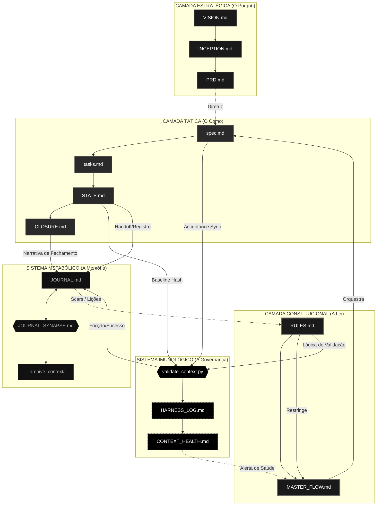

# 📡 RX-COMMUNICATIONS: Mapa de Conectividade Global (v2)

Este documento é o SSOT da topologia técnica do projeto. Ele descreve o "sistema nervoso" do ecossistema, mapeando como os artefatos de governança e execução se comunicam através de sinais, dependências e gatilhos.

---

## 🌌 1. Mapa Mestre de Conectividade (Visão Holística)

---

## 🔗 2. Tabela de Sinais de Conectividade

| Origem | Destino | Natureza do Sinal | Propósito |
| :--- | :--- | :--- | :--- |
| `PRD.md` | `spec.md` | **Diretriz** | Garante que o código atende ao requisito de negócio. |
| `RULES.md` | `validate_context.py` | **Protocolo** | Alimenta o "DNA" do que deve ser fiscalizado. |
| `MASTER_FLOW.md` | `spec.md` | **Orquestração** | Gatilho de nascimento de uma nova tarefa. |
| `STATE.md` | `validate_context.py` | **Evidência** | Foto física (hash) para garantir que não há drift. |
| `JOURNAL_SYNAPSE.md` | `JOURNAL.md` | **Metabólica** | Limpeza e compressão de memória para evitar bloat. |
| `JOURNAL.md` | `RULES.md` | **Aprendizado** | Cicatrizes (Scars) de erros passados viram novas leis. |
| `@gov-friction-analyst` | `JOURNAL.md` | **Mitigação** | Propaga planos de ação para resolver atritos de governança. |
| `closure-thinker` | `CLOSURE.md` | **Síntese** | Analisa a realidade factual do commit para gerar a narrativa de fechamento. |

---

## 🛡️ 3. Governança da Conectividade
Qualquer alteração na responsabilidade de um arquivo (Glossário) ou na forma como eles se tocam deve ser refletida neste Mapa. Este documento é o guia definitivo para agentes de IA entenderem seu papel dentro do organismo H.O.K Forge.

---

## 🕸️ 4. Matriz de Acoplamento Granular (Adjacency List)

Esta seção detalha o *blast radius* (raio de impacto) dos arquivos do ecossistema mapeados no `FILE_GLOSSARY.md`. Se você alterar o "Arquivo A", consulte abaixo quais arquivos sofrem o impacto lógico ou operacional dessa mudança.

### 🏛️ Raiz do Projeto
- **`README.md`**
  - **Afeta:** Acesso externo / Comercial (Nenhum impacto interno).
  - **É Afetado Por:** `VISION.md`, `ARCHITECTURE.md` (Mudanças estruturais devem refletir na documentação raiz).
- **`README_CONTEXT.md`**
  - **Afeta:** Comportamento global das IAs.
  - **É Afetado Por:** `RULES.md`, `FILE_GLOSSARY.md` (Mudanças na governança exigem atualização deste manual).
- **`VERSION.md`**
  - **Afeta:** `HARNESS_LOG.md` (Logs validam os artefatos contra a versão vigente).
  - **É Afetado Por:** `JOURNAL.md` (Transições de Sprint/Release), Scripts CI/CD.
- **`TEMPLATE_MIGRATION.md`**
  - **Afeta:** Todo novo script de migração `.sql` da equipe de banco de dados.
  - **É Afetado Por:** `ARCHITECTURE.md` (Padrões de banco de dados).
- **`GUIA_ESTABILIZACAO_NOTEBOOKLM.md`**
  - **Afeta:** Configuração do ambiente humano.
  - **É Afetado Por:** Atualizações na extensão do Google/MCP.

### 🧠 Córtex (`.context/brain/`)
- **`VISION.md`**
  - **Afeta:** `INCEPTION.md`, `ROADMAP.md` (A bússola do projeto. Tudo deriva daqui).
  - **É Afetado Por:** `MARKET_INBOX.md`, `economics.md` (Decisões de negócio pivotam a visão).
- **`INCEPTION.md`**
  - **Afeta:** `PRD.md` (O Inception traça a fronteira de onde o PRD pode atuar).
  - **É Afetado Por:** `VISION.md`.
- **`PRD.md`**
  - **Afeta:** `spec.md` (É o repositório de requisitos que o Spec Driver consume para programar).
  - **É Afetado Por:** `INCEPTION.md`.
- **`ROADMAP.md`**
  - **Afeta:** Priorização de Sprints no `JOURNAL.md`.
  - **É Afetado Por:** `VISION.md`.
- **`RULES.md`**
  - **Afeta:** **[CRÍTICO] TODOS.** Restringe ações do `MASTER_FLOW.md` e alimenta scripts como o `validate_context.py`.
  - **É Afetado Por:** `LEARNINGS.md`, `JOURNAL.md` (Cicatrizes de guerra e bugs viram novas leis inquebráveis).
- **`MASTER_FLOW.md`**
  - **Afeta:** `spec-driver.md`, `qa-validator.md` (Guia o comportamento e a sequência de raciocínio lógico dos agentes).
  - **É Afetado Por:** `RULES.md`, `TLC_INTEGRATION.md`.
- **`AGENT_REGISTRY.md`**
  - **Afeta:** O escopo de atuação de todas as IAs. Define quem pode editar qual arquivo.
  - **É Afetado Por:** Criação/Refatoração dos arquivos `.md` na pasta `.agent/`.
- **`PROMPT_LIBRARY.md`**
  - **Afeta:** Qualidade da interação e taxa de acerto do Orquestrador Humano.
  - **É Afetado Por:** Aulas e adaptações práticas nos workflows.
- **`START_HERE.md`**
  - **Afeta:** Curva de aprendizado de humanos que chegam ao projeto.
  - **É Afetado Por:** Refatorações pesadas no Córtex.
- **`FILE_GLOSSARY.md`**
  - **Afeta:** `rx-communications.md` e SAM / `validate_context.py` (Se um nome muda aqui, a governança trava).
  - **É Afetado Por:** Criação/Remoção física de arquivos `.md` no ecossistema (Requer Sincronia de Aceite).
- **`SCRIPT_GLOSSARY.md`**
  - **Afeta:** Orquestração do `HARNESS_REGISTRY.md`.
  - **É Afetado Por:** Alterações/criações na pasta de código de governança (`.context/_scripts/`).
- **`HARNESS_REGISTRY.md`**
  - **Afeta:** `HARNESS_LOG.md` (Dita quais portões de QA devem ser cruzados).
  - **É Afetado Por:** `RULES.md` (Nova regra = Novo Gate no Harness).
- **`TLC_INTEGRATION.md`**
  - **Afeta:** A filosofia de execução das tarefas no `MASTER_FLOW.md`.
  - **É Afetado Por:** Decisões arquiteturais do Orquestrador.
- **`LEARNINGS.md`**
  - **Afeta:** `RULES.md`, `SSD_ERRORS_LEDGER.md` (Transforma dor em lei sistêmica).
  - **É Afetado Por:** Cicatrizes e análises de pós-morte documentadas no `JOURNAL.md`.

### 🔧 Manutenção (`.context/maintenance/`)
- **`JOURNAL.md`**
  - **Afeta:** `LEARNINGS.md` (Gera insumo).
  - **É Afetado Por:** **[CRÍTICO] TODOS.** É o poço gravitacional. Todas as execuções (Specs, Handoffs, Bugs) convergem e desaguam aqui. Recebe dados de `STATE.md`, scripts de SAM, e do humano.
- **`HARNESS_LOG.md`**
  - **Afeta:** `CONTEXT_HEALTH.md` (Painel visual de saúde) e bloqueios de transição.
  - **É Afetado Por:** Scripts do Harness (`validate_context.py` etc).
- **`TECHNICAL_REQUIREMENTS.md`**
  - **Afeta:** `ARCHITECTURE.md` e decisões de framework nas `spec.md`.
  - **É Afetado Por:** O C-Level (Humano) ou atualizações de dependências críticas.
- **`ARCHITECTURE.md`**
  - **Afeta:** Como a `spec.md` resolve problemas técnicos e onde os arquivos são colocados.
  - **É Afetado Por:** `TECHNICAL_REQUIREMENTS.md`.
- **`TESTS.md`**
  - **Afeta:** Nível de exigência do QA Validator.
  - **É Afetado Por:** `RULES.md`.
- **`rx-*.md` (Anotomy, Biology, Communications, Learnings, SAM)**
  - **Afeta:** Conhecimento "Meta" do sistema. Servem para IAs auditar e desenhar plantas.
  - **É Afetado Por:** Seus respectivos espelhos. Ex: Mudar pastas -> Muda `rx-anatomy.md`. Mudar glossário -> Muda `rx-communications.md`.
- **`JOURNAL_SYNAPSE.md`**
  - **Afeta:** Tamanho do `JOURNAL.md` (Regras de purga de contexto).
  - **É Afetado Por:** Picos no "Token Bloat" detectados pelo `CONTEXT_HEALTH.md`.

### 📊 Monitoramento (`.context/monitoring/`)
- **`PROJECT_INDEX_01/02.md`**
  - **Afeta:** Acesso primário ("Mapa Topográfico") para as IAs encontrarem caminhos antes do `project_bundler.py`.
  - **É Afetado Por:** Scripts de autogeração (`generate_index.py`).
- **`CONTEXT_HEALTH.md`**
  - **Afeta:** Decisões operacionais do Humano e do `EXECUTION_BUFFER.md`. Se estiver saturado, paralisa o avanço.
  - **É Afetado Por:** Tamanho global do diretório `.context/`.
- **`EXECUTION_BUFFER.md`**
  - **Afeta:** Controle de velocidade ("Cooldown") das IAs autônomas.
  - **É Afetado Por:** Carga excessiva no HOK Governor.

### 🧪 Specs (`.specs/`)
- **`spec.md`**
  - **Afeta:** **[CRÍTICO] Source Code.** É a única ponte oficial que altera o código de produção do projeto. Modifica `STATE.md` à medida que avança.
  - **É Afetado Por:** `PRD.md`, `ARCHITECTURE.md`, `RULES.md`, `spec_v3.md` (Template base).
- **`STATE.md`**
  - **Afeta:** `JOURNAL.md` (Dispara os Handoffs), SAM (Provê hashes criptográficas), `CLOSURE.md` (Provê evidências).
  - **É Afetado Por:** Tarefas assinaladas como "Feitas" na `spec.md` ou `tasks.md`.
- **`CLOSURE.md`**
  - **Afeta:** `JOURNAL.md` (Consolida narrativa final), `LEARNINGS.md` (Gera sementes de SCARs).
  - **É Afetado Por:** `spec.md`, `STATE.md`, `JOURNAL.md`, `Git history`.
- **`SSD_PLAYBOOK.md` & `SSD_ERRORS_LEDGER.md`**
  - **Afeta:** Comportamento tático do `spec-driver`.
  - **É Afetado Por:** Reflexões em loop durante execuções.

### 🤖 Agentes (`.agent/`)
- **`README_subagents.md`**
  - **Afeta:** Entendimento humano e documentação de prompt.
  - **É Afetado Por:** `AGENT_REGISTRY.md`.
- **`spec_v3.md` (Template)**
  - **Afeta:** Todo o esqueleto inicial de uma nova `spec.md` criada.
  - **É Afetado Por:** Atualizações do framework H.O.K para V4/V5.
- **`subagents/*.md` (`spec-driver`, `qa-validator`, `readme_chain`)**
  - **Afeta:** Personalidade, restrições e workflow isolado do respectivo agente.
  - **É Afetado Por:** `MASTER_FLOW.md` e `RULES.md`.

---

## ⚙️ 5. Matriz de Acoplamento de Automação (Scripts)

Esta seção mapeia os "músculos" do ecossistema definidos no `SCRIPT_GLOSSARY.md`. Cada script age como uma ponte, lendo informações passivas (Leis/Contexto) e escrevendo resultados determinísticos. Compreender estas conexões previne a quebra da governança ativa.

### 🚀 Orquestrador Universal
- **`run_context.py`**
  - **Lê (Depende de):** Comandos do usuário e argumentos CLI.
  - **Escreve em (Afeta):** Orquestra todos os demais scripts de `.context/_scripts/`.
  - **Gatilho:** `npm run context:*`

### 🔧 Skills & Agentes (Automação Cognitiva)
- **`closure-thinker/SKILL.md`**
  - **Lê (Depende de):** `spec.md`, `STATE.md`, `JOURNAL.md`, `.git/diff`.
  - **Escreve em (Afeta):** `CLOSURE.md`.
  - **Gatilho:** Invocado na Skill 9 (HANDOFF).
- **`journal-sync/SKILL.md`**
  - **Lê (Depende de):** `git status`, `rx-communications.md`, `JOURNAL.md`.
  - **Escreve em (Afeta):** `JOURNAL.md`, arquivos no Blast Radius (cascata).
  - **Gatilho:** Invocado manualmente ou via rito de fechamento.

### 📡 Motores de Visão
- **`project_bundler.py`**
  - **Lê (Depende de):** Estrutura de diretórios do repositório inteiro.
  - **Escreve em (Afeta):** `PROJECT_INDEX_01/02.md` (modo map) e `.context/contexto.md` (modo bundle).
  - **Gatilho:** `npm run context:map` ou `context:bundle`

### 🛡️ Gates de Governança (Zero Trust)
- **`harness_runner.py`**
  - **Lê (Depende de):** `spec.md`, arquivos em `.specs/features/`.
  - **Escreve em (Afeta):** `HARNESS_LOG.md` e impede o `git commit`.
  - **Gatilho:** Husky `pre-commit` ou `npm run context:harness`
- **`workflow_journal_auditor.py` (SAM)**
  - **Lê (Depende de):** `JOURNAL.md`, `.git/diff`.
  - **Escreve em (Afeta):** Regras de aprovação do commit.
  - **Gatilho:** Integrado no `context:all` ou CI.
- **`validate_context.py`**
  - **Lê (Depende de):** `STATE.md`, `RULES.md`, `FILE_GLOSSARY.md`, `JOURNAL.md`.
  - **Escreve em (Afeta):** `HARNESS_LOG.md` e `CONTEXT_HEALTH.md`.
  - **Gatilho:** `npm run context:validate`
- **`check_version_consistency.py`**
  - **Lê (Depende de):** `VERSION.md`, `package.json`, `INCEPTION.md`.
  - **Escreve em (Afeta):** Logs de erro no pipeline.
  - **Gatilho:** Integrado no `context:all`.
- **`secrets_scanner.py`**
  - **Lê (Depende de):** Código fonte e arquivos `.md`.
  - **Escreve em (Afeta):** Bloqueio de commit por vazamento.
  - **Gatilho:** Integrado no `context:all`.
- **`write_with_validation.py`**
  - **Lê (Depende de):** Solicitações de alteração dos agentes, `RULES.md`.
  - **Escreve em (Afeta):** O código fonte do projeto (único script com permissão física de escrita autônoma guiada).
  - **Gatilho:** Acionado pelo Subagente / Skill 6.
- **`validate_commit_msg.py`**
  - **Lê (Depende de):** Arquivo temporário de commit-msg do Git.
  - **Escreve em (Afeta):** Rejeição/Aprovação da mensagem do git.
  - **Gatilho:** Husky `commit-msg`.

### 🧠 Motores Epistemológicos
- **`affinity_lite.py`**
  - **Lê (Depende de):** Git Log (`git log`), Conteúdo de Docs (`.md`), Scripts (`.py`).
  - **Escreve em (Afeta):** `rx-affinity-lite.md` e `rx-affinity-lite.json` (Revela Acoplamentos Fantasma).
  - **Gatilho:** `npm run context:affinity` (a ser adicionado no package.json).
- **`context_oracle.py`**
  - **Lê (Depende de):** Documentos e Wiki (`.context/`).
  - **Escreve em (Afeta):** Respostas no terminal / Prompt RAG.
  - **Gatilho:** `npm run context:oracle`
- **`enrich_context.py`**
  - **Lê (Depende de):** `VISION.md`.
  - **Escreve em (Afeta):** `INCEPTION.md`.
  - **Gatilho:** `npm run context:enrich`
- **`ingest_wiki_guard.py`**
  - **Lê (Depende de):** Pasta `RAW/`.
  - **Escreve em (Afeta):** Pasta `WIKI/` (Pílulas de contexto).
  - **Gatilho:** `npm run context:ingest-guard`
- **`lint_wiki.py`**
  - **Lê (Depende de):** Arquivos em `WIKI/`.
  - **Escreve em (Afeta):** Status de lint (Aprova ou Reprova).
  - **Gatilho:** `npm run context:lint`
- **`oracle_analytics.py`**
  - **Lê (Depende de):** Base de dados RAG.
  - **Escreve em (Afeta):** Relatórios de saúde do Oráculo.
  - **Gatilho:** `npm run context:oracle-analytics`
- **`learnings_aggregator.py`**
  - **Lê (Depende de):** `JOURNAL.md`, `SSD_ERRORS_LEDGER.md`.
  - **Escreve em (Afeta):** `LEARNINGS.md`.
  - **Gatilho:** `npm run context:learnings`
- **`inject_learnings.py`**
  - **Lê (Depende de):** `LEARNINGS.md`, `spec.md` da feature atual.
  - **Escreve em (Afeta):** `*.enriched.md`.
  - **Gatilho:** `npm run context:inject`
- **`blast_radius.py`**
  - **Lê (Depende de):** `graph.json`, `rx-communications.md`.
  - **Escreve em (Afeta):** `JOURNAL.md`, stdout (buckets priorizados).
  - **Gatilho:** Skill `journal-sync`.

### 🧹 Limpeza e Manutenção
- **`purge_journal.py`**
  - **Lê (Depende de):** `JOURNAL.md`, `JOURNAL_SYNAPSE.md`.
  - **Escreve em (Afeta):** Modifica o `JOURNAL.md` (apaga histórico antigo) e escreve em `_archive_context/`.
  - **Gatilho:** `npm run context:purge`
- **`cleanup_specs.py`**
  - **Lê (Depende de):** Pasta `.specs/features/` (Status `DONE`).
  - **Escreve em (Afeta):** Arquiva specs finalizadas em `.specs/_archive/`.
  - **Gatilho:** `npm run context:cleanup`
- **`health_sync.py`**
  - **Lê (Depende de):** Arquivos do `HARNESS_LOG.md` e logs variados.
  - **Escreve em (Afeta):** `CONTEXT_HEALTH.md`.
  - **Gatilho:** Automático (Periódico).
- **`sync_project.py`**
  - **Lê (Depende de):** `package.json`, Migrations do BD.
  - **Escreve em (Afeta):** `TECHNICAL_REQUIREMENTS.md`, registros do banco.
  - **Gatilho:** `npm run context:sync`
- **`migration_registry.py`**
  - **Lê (Depende de):** Scripts `.sql` gerados.
  - **Escreve em (Afeta):** Relatório de Migrations ativas.
  - **Gatilho:** Via `sync_project.py`.

### 🔧 Módulos Compartilhados (Auxiliares)
- **`_tz_utils.py`** & **`_wiki_log_utils.py`**
  - **Afetam:** Todos os scripts de log e metadados acima (padronizando fusos e escritas unificadas).
  - **Gatilho:** Importação via `import`.
