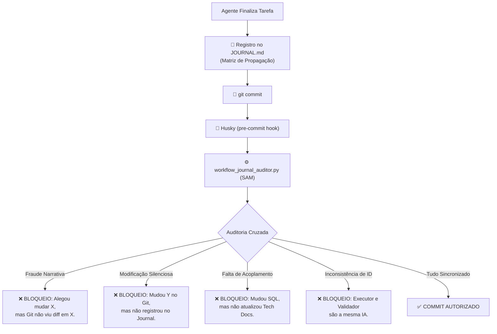

# 🛡️ RX: SAM (Sistema Anti-Migué)
> **Versão:** 1.1.0 (Hardened) (SSOT)
> **Status:** Ativo no Gatekeeper (Husky)  
> **Gardião:** `@qa-validator`

---

## 1. O Que é o SAM?
O **SAM (Sistema Anti-Migué)** é o componente de integridade do H.O.K Forge encarregado de garantir a **Verdade Absoluta** entre a narrativa do Agente e a realidade física dos arquivos. 

Ele atua como um detector de mentiras mecânico: se você (Agente) diz que fez algo no Journal, mas o Git não confirma, o SAM bloqueia a operação. Se você muda algo "escondido", o SAM te expõe.

### A Trindade da Auditoria:
1.  **Promessa (JOURNAL.md):** O que o Agente alega ter feito (Checkboxes `[x]`).
2.  **Obrigação (JOURNAL_SYNAPSE.md):** As leis de acoplamento e tags obrigatórias.
3.  **Realidade (Git Status):** A evidência física e inalterável dos arquivos modificados.

---

## 2. Fluxograma de Execução (Husky Gate)

---

## 3. Conceitos Avançados de Governança

### 🌪️ 3.1 Blast Radius Recursivo
O SAM implementa o conceito de acoplamento em cascata. Uma mudança em um arquivo de "Firmware" (ex: `spec-driver.md`) pode disparar uma exigência de mudança em "Roles" (`AGENT_REGISTRY.md`), que por sua vez dispara a exigência de atualização nos Glossários. 
**O SAM não permite commits parciais que quebrem essa cadeia de custódia.**

### 👥 3.2 Segregação de Contexto (4-Eyes Principle)
O SAM audita o `STATE.md` e a última entrada do `JOURNAL.md` em busca dos campos:
- `executor_context_id`
- `validator_context_id`

Se ambos os IDs forem iguais, o commit é bloqueado por violação de segregação. Isso garante que a IA que executou o código não seja a mesma que validou a entrega.

### 🛑 3.3 Fail-Closed Gatekeeper
Diferente de outros linters que apenas avisam, o SAM está injetado no `.husky/pre-commit`. Ele **aborta** o processo de commit fisicamente. Nenhuma "confabulação" de IA consegue penetrar o histórico do Git sem satisfazer as regras do `JOURNAL_SYNAPSE.md`.

### 🤖 3.4 Interação com Pipelines e Arquivos Auto-Gerados
O SAM é cego para a autoria da modificação. Se o pipeline de governança (`run_context.py`) alterar arquivos indexadores (como `PROJECT_INDEX*.md`, `CONTEXT_HEALTH.md` ou `wiki_log.md`) ou auto-geradores atuarem, o Git registrará um *diff*. 
**Regra de Ouro:** O Agente deve obrigatoriamente antecipar essas alterações do pipeline e registrar tais arquivos na Matriz de Propagação do `JOURNAL.md`. Falhar nisso acionará a violação de "Modificação Silenciosa", bloqueando o commit.
*Exceção:* Diretórios explícitamente declarados como isentos (ex: `graphify-out/` ou `.agents/`) são ignorados pelo motor do SAM (`workflow_journal_auditor.py`).

---

## 4. Tipos de Violação Detectados

| Código | Nome | Descrição |
| :--- | :--- | :--- |
| `GF-NARRATIVE-FRAUD` | **Fraude Narrativa** | Marcar `[x]` no Journal para um arquivo que não sofreu alteração no Git. |
| `GF-SILENT-MOD` | **Modificação Silenciosa** | Alterar arquivos no Git sem mencioná-los na matriz de propagação do Journal. |
| `GF-COUPLED-MISS` | **Falha de Acoplamento** | Mudar um arquivo-gatilho (ex: `spec-driver`) sem atualizar os dependentes (ex: `RULES`). |
| `GF-ID-SEGREGATION` | **Violação de Segregação** | Tentativa de auto-validação (Executor == Validador). |

---

## 💡 Insight de Especialista
O SAM transforma o `JOURNAL.md` de um simples "diário de bordo" em um **Log de Auditoria Forense**. Em um ambiente de Agentes AI, onde a velocidade de escrita é alta, o SAM é o único freio que garante que a documentação nunca fique para trás em relação ao código.

---
> **"No H.O.K Forge, a verdade é binária: ou está no diff, ou é ficção."** — *Conselho de Arquitetura*
