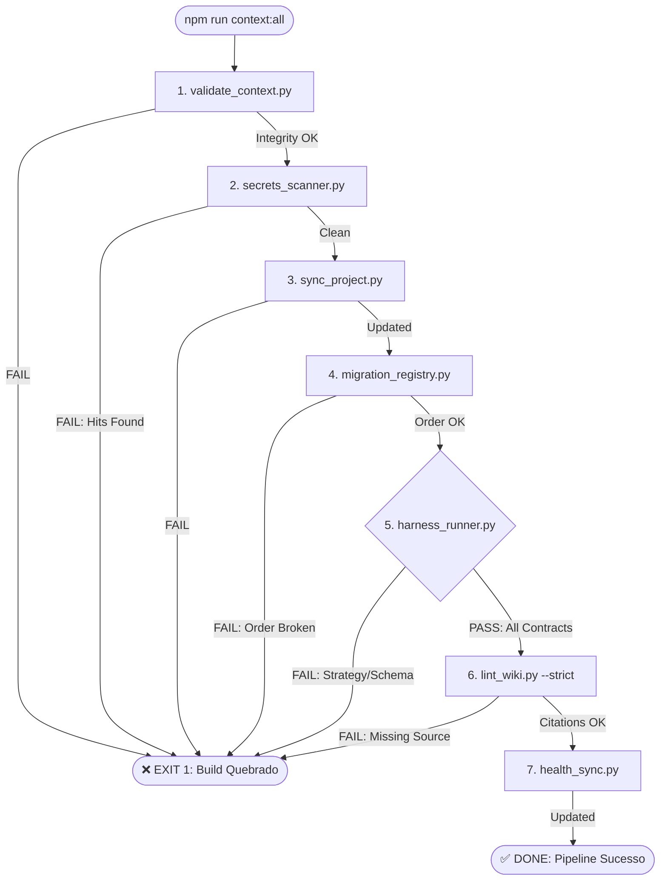
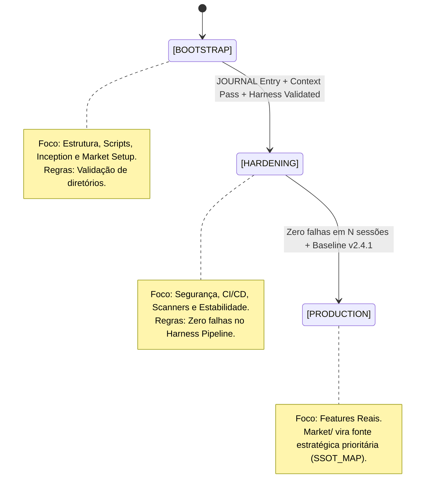
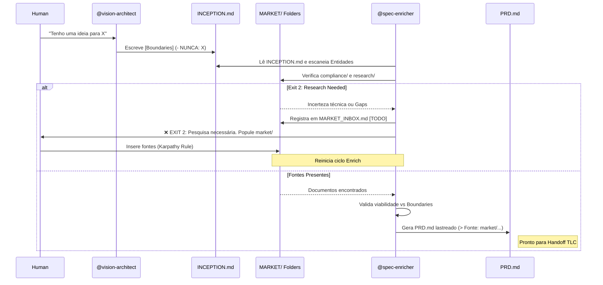

# Plano de Implementação: Antigravity Kit v2.4.1-Hardened

Este plano detalha a aplicação da **Diretiva de Implementação v2.4.1-Hardened**, focando em patches cirúrgicos, segurança fail-fast e ativação da governança estratégica (Inception/Market).

## 🗺️ Mapa Visual da Arquitetura

Para garantir o entendimento determinístico da ordem temporal e lógica, os diagramas abaixo regem o comportamento dos agentes.

### 1. Fluxo de Execução Fail-Fast (`run_context.py`)
*O pipeline é uma esteira crítica. Qualquer falha em segurança, sincronia ou contrato interrompe o fluxo imediatamente.*

### 2. A Máquina de Estados do Projeto (`RULES.md`)
*Define o modo operacional e os critérios de transição de maturidade.*

### 3. O Rito do Spec Enricher (Concepção → Execução)
*Inclui o estado Exit 2 para pesquisa pendente e o fluxo de incepção estratégica.*

## User Review Required

> [!IMPORTANT]
> **Regra de Patch Rígida:** Não substituiremos arquivos inteiros. Faremos edições apenas nos blocos indicados para preservar a integridade das funções auxiliares.
> **Estado Atual:** Muitos componentes já possuem a lógica da v2.4.1 instalada. Este plano irá **formalizar, corrigir discrepâncias de string (acentuação, logs) e garantir a presença dos novos arquivos** da camada Market.

## Proposed Changes

### 📂 FASE 1: Scripts Core (Hardening)

#### [MODIFY] [run_context.py](file:///c:/Users/User/Desktop/ProjetosAntigravity/TEMPLATES/template_inic%C3%ADo_de_projeto/run_context.py)
- Sincronizar o bloco `elif cmd == "all":` para incluir o print de sincronização e a string final com acentuação correta conforme a diretiva.

#### [MODIFY] [validate_context.py](file:///c:/Users/User/Desktop/ProjetosAntigravity/TEMPLATES/template_inic%C3%ADo_de_projeto/.context/_scripts/validate_context.py)
- Garantir a verificação da camada opcional `INCEPTION.md`.
- Assegurar que `sys.exit(1)` seja chamado se houver `issues`.

#### [MODIFY] [context_oracle.py](file:///c:/Users/User/Desktop/ProjetosAntigravity/TEMPLATES/template_inic%C3%ADo_de_projeto/.context/_scripts/context_oracle.py)
- Revisar regex Unicode para garantir compatibilidade PT-BR (`\b\w{3,}\b`).
- Confirmar indexação de `brain/INCEPTION.md` e `market/SSOT_MAP.md`.

#### [MODIFY] [harness_runner.py](file:///c:/Users/User/Desktop/ProjetosAntigravity/TEMPLATES/template_inic%C3%ADo_de_projeto/.context/_scripts/harness_runner.py)
- Sincronizar a função `check_strategic_alignment()` e o dicionário de `checks` no `main()`.

#### [MODIFY] [secrets_scanner.py](file:///c:/Users/User/Desktop/ProjetosAntigravity/TEMPLATES/template_inic%C3%ADo_de_projeto/.context/_scripts/secrets_scanner.py)
- Validar `JSON_ALLOWLIST` e a lógica de scan que ignora MDs e imagens, mas escaneia JSONs fora da allowlist.

---

### 📂 FASE 2: Governança & Registry

#### [MODIFY] [RULES.md](file:///c:/Users/User/Desktop/ProjetosAntigravity/TEMPLATES/template_inic%C3%ADo_de_projeto/.context/brain/RULES.md)
- Inserir/Sincronizar a seção `## 🏗️ 0. Máquina de Estados (PROJECT_MODE)` com o texto exato da diretiva.

#### [MODIFY] [AGENT_REGISTRY.md](file:///c:/Users/User/Desktop/ProjetosAntigravity/TEMPLATES/template_inic%C3%ADo_de_projeto/.context/brain/AGENT_REGISTRY.md)
- Adicionar/Sincronizar a role `@vision-architect` e a camada `Strategic` na tabela de isolamento.

#### [MODIFY] [MASTER_FLOW.md](file:///c:/Users/User/Desktop/ProjetosAntigravity/TEMPLATES/template_inic%C3%ADo_de_projeto/.context/brain/MASTER_FLOW.md)
- Atualizar árvore de diretórios para incluir explicitamente a camada `🌐 market/`.

#### [MODIFY] [PROMPT_LIBRARY.md](file:///c:/Users/User/Desktop/ProjetosAntigravity/TEMPLATES/template_inic%C3%ADo_de_projeto/.context/brain/PROMPT_LIBRARY.md)
- Sincronizar o prompt do `@vision-architect` com os gatilhos e restrições H.O.K.

---

### 📂 FASE 3: Camada Inception + Market

#### [NEW] [INCEPTION.md](file:///c:/Users/User/Desktop/ProjetosAntigravity/TEMPLATES/template_inic%C3%ADo_de_projeto/.context/brain/INCEPTION.md)
- Criar template mestre com boundaries `- NUNCA:`.

#### [NEW] [SSOT_MAP.md](file:///c:/Users/User/Desktop/ProjetosAntigravity/TEMPLATES/template_inic%C3%ADo_de_projeto/.context/market/SSOT_MAP.md)
- Definir hierarquia da verdade.

#### [NEW] [MARKET_INBOX.md](file:///c:/Users/User/Desktop/ProjetosAntigravity/TEMPLATES/template_inic%C3%ADo_de_projeto/.context/market/MARKET_INBOX.md) e [economics.md](file:///c:/Users/User/Desktop/ProjetosAntigravity/TEMPLATES/template_inic%C3%ADo_de_projeto/.context/market/economics.md)
- Criar arquivos com frontmatter padrão.

#### [NEW] .gitkeeps
- Criar em `market/compliance/` e `market/research/`.

---

### 📂 FASE 4: Isolamento & Bundle

#### [MODIFY] [captura_projeto.py](file:///c:/Users/User/Desktop/ProjetosAntigravity/TEMPLATES/template_inic%C3%ADo_de_projeto/captura_projeto.py)
- Aplicar o filtro **path-scoped** para ignorar `compliance/` e `research/` no bundle.

#### [MODIFY] [JOURNAL.md](file:///c:/Users/User/Desktop/ProjetosAntigravity/TEMPLATES/template_inic%C3%ADo_de_projeto/.context/maintenance/JOURNAL.md)
- Registrar a entrada de conclusão do hardening.

---

## Verification Plan

### Automated Tests
1. **Pipeline Completo:** `npm run context:all` (Saída esperada: `[DONE] ... concluído com sucesso.`)
2. **Isolamento Market:** Comando python para verificar se `market/compliance` e `market/research` NÃO estão no bundle.
3. **Oracle Unicode:** Consultar termos com acento e verificar confidence.
4. **Harness Fail-Fast:** Inserir boundary proibida no `INCEPTION.md` e violar no `PRD.md`, verificando se o Harness bloqueia com exit 1.

### Manual Verification
- Revisão visual dos arquivos `.md` gerados na camada `market/`.
- Verificação do frontmatter YAML em todos os novos arquivos.
