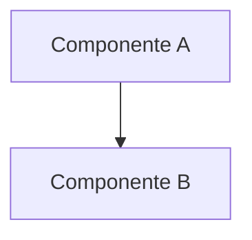

# 🎨 Design & Arquitetura

## 📐 Diagramas (Mermaid)

```mermaid
graph TD
    A[Componente A] --> B[Componente B]
```

## 🏗️ Decisões Técnicas
- **Abordagem:** [Explicação da escolha técnica]

## 🧩 Modificações Estruturais
- [ ] [Arquivo/Componente]
