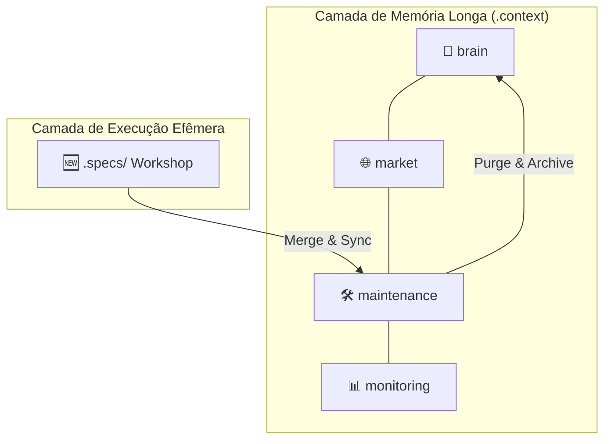
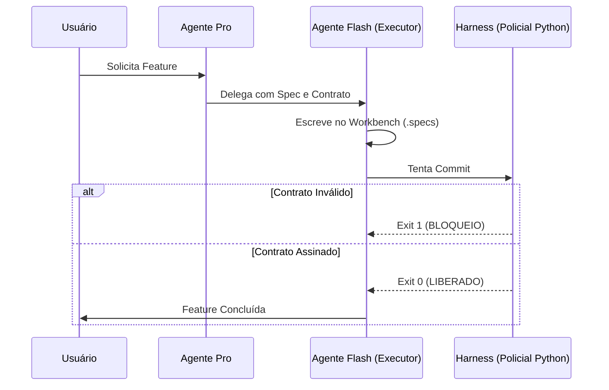

# 🪐 Resenha Técnica: Antigravity Kit v2.5 (H.O.K.)

O **Antigravity Kit (H.O.K. - Hardened Operations Kit)** é um framework de governança cibernética projetado para transformar repositórios comuns em ecossistemas inteligentes prontos para coexistência com IAs de alta performance. Diferente de uma documentação estática, o H.O.K. atua como o **Governador de Contexto**, garantindo que a IA opere sob restrições físicas e lógicas invioláveis.

---

## 🏛️ 1. Arquitetura em Camadas (O `.context`)

O diretório `.context` é o centro nervoso do framework. Ele é dividido em camadas funcionais para evitar a "alucinação por inchaço" (Context Bloat).

### 📂 Estrutura de Pastas e Componentes:

1.  **`🧠 brain/` (Cérebro Estratégico)**:
    - **`INCEPTION.md`**: Define o que o projeto É e o que NUNCA será. É a SSOT (Single Source of Truth) estratégica.
    - **`RULES.md`**: O manual de conduta da IA. Contém as travas de segurança e os protocolos de interação.
    - **`MASTER_FLOW.md`**: O blueprint de como os dados e as tarefas devem fluir.

2.  **`🌐 market/` (Inteligência de Mercado & Karpathy Wiki)**:
    - **`RAW/`**: "Minério bruto" (dossiês, PDFs convertidos, transcrições). **IAs não leem esta pasta!**
    - **`WIKI/`**: Conhecimento destilado e atômico (padrão Karpathy). São as pílulas que o Oráculo consome.
    - **`compliance/`**: Regras externas e restrições legais.

3.  **`🛠️ maintenance/` (A Casa do Housekeeper)**:
    - **`JOURNAL.md`**: Log vivo de decisões técnicas complexas. Tem limite de 600 linhas para manter o contexto magro.
    - **`schema.sql`**: A verdade definitiva sobre o Banco de Dados. Impede a IA de alucinar tabelas que não existem.
    - **`TECHNICAL_REQUIREMENTS.md`**: Inventário técnico de stacks e dependências.

4.  **`📊 monitoring/` (O Guardião)**:
    - **`CONTEXT_HEALTH.md`**: Dashboard gerado via script que mostra o consumo de tokens e a saúde dos arquivos.

5.  **`⚙️ _scripts/` (O Motor)**:
    - Automações em Python puro (stdlib-only) que fazem o linter de WIKI, validação de specs e purge de journal.

---

## 🚦 2. O Ciclo de Vida: The Workshop vs. Governança

O H.O.K. v2.5 separa o **caos da criação** da **ordem da documentação**:

-   **`.specs/` (O Workshop)**: É um ambiente efêmero. Aqui a IA abre uma "Spec Atômica", realiza a tarefa e, após o sucesso, a pasta é destruída. Nada de lixo atômico na raiz!
-   **TLC (Specify | Design | Tasks | Execute)**: O processo disciplinado onde nenhuma linha de código é escrita sem um contrato assinado (`qa_signoff: true`).

---

## 📖 3. Protocolo de Destilação Karpathy (Zero RAG)

Este é o diferencial da v2.5. Para evitar o custo e a imprecisão de bancos de dados vetoriais (RAG), o H.O.K. usa **Estratificação de Densidade**:

1.  **Depositar (RAW)**: Informação bruta entra na pasta RAW.
2.  **Destilar (WIKI)**: IA ou Humano transforma o RAW em arquivos Markdown pequenos e densos.
3.  **Rastrear (Lint)**: O arquivo WIKI **obrigatoriamente** cita sua fonte RAW. Se não citar, o Husky (Pre-commit) bloqueia o commit.
4.  **Consultar (Oráculo)**: A IA usa o script `context_oracle.py` para buscar termos na WIKI e retornar o arquivo **INTEGRAL**, garantindo que ela tenha a visão completa do conceito, sem cortes.

---

## 🛡️ 4. Governança Inflexível (Fail-Closed)

A versão 2.5 implementou a "Física do Repositório":
-   **Anti-Atropelo**: IAs leves (Gemini Flash) são proibidas de comitar sem proposta prévia e aprovação humana.
-   **Harness Lock**: Se não houver uma Spec ativa e assinada em `.specs/`, o `harness_runner.py` retorna `Exit 1` e aborta o commit. Não há commit sem contrato.

---

> **Nota de Release v2.5:** O Antigravity Kit transforma a interação com IAs em um processo industrial de alta precisão, onde o contexto é blindado e a alucinação é mitigada por travas físicas de código.
